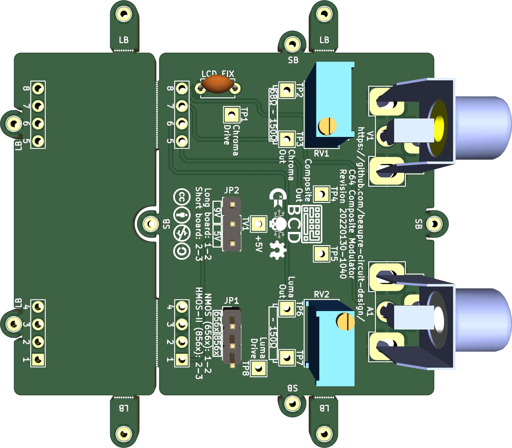

# c64-rf-modulator-replacement
C64 Composite/S-Video RF Modulator Replacement

## Quick Links
* [Schematic](pdf/C64-Composite-Modulator.pdf)

* [Gerber Files](gerbers)

* [PCB Renderings](images)

* [Photos](images)

# Introduction 
This is a remix of mbarszcz-pcb's version of a C64 RF Modulator replacement based on the schematics of similar designs like [Zero-X/OMS's Modified Commodore RF Modulator Design](images/zerox-oms-modulator_simple-schematic.png) and [JMP$FCE2's S-Video only design](images/jmp$fce2-schematic.png). This board can be used to replace a damaged or defective RF modulator in your C64, to improve the sharpness of your video output, or as a modern solution to replace the composite/luma/chroma output functionality of the original modulator on new motherboards such as the SixtyClone or Bwack’s KU-14194.

This design has a few goals that set it apart from the others:

1. It is a universal solution that fits and is electrically compatible with both the C64 and C64C without having to change components on the board or run jumper wires for power.

2. It is inexpensive to build with only a single, small PCB and SMD components that can be assemble by most rapid prototyping compagnies (everything included for JLCPCB but can be easilly adapted for any other service.)

3. It provides high quality S-Video (Y/C) output on the standard A/V output of the C64 while maintaining composite video output for compatibility.

4. It provides adjustable luma/chroma output levels to fine-tune the S-video signal. This allows for the best possible compatibility with a wide variety of different board revisions, VIC chips, aging components and monitors. Adjustable levels mean this board can also be used with s-video cables with or without an inline resistor to eliminate “checkerboarding” caused by too high of a chroma level.

# Compatibility
This RF modulator replacement is compatible with motherboard revisions 250407, 250425, 250466, and 250469, and both NTSC and PAL VIC-II chips. I have not tested it, but I believe it should also be compatible with Bwack's KU-14194 board as well since it uses the standard longboard RF modulator. It is not compatible, however, with the early revision 326298-01 boards with the 5 Pin AV Output. This revision uses a different modulator pin layout, and the video signals are not combined in the modulator. They are instead processed with discrete components inside the VIC-II can.

# Gathering the components
Kicad files are available for you to view or modify as you see fit. Gerber and SMT positioning files are available that can be uploaded directly to JLCPCB to make and assemble your own boards. The Bill of Materials (BOM) can be found [here](C64-Composite-Modulator-Bom.xlsx) with example parts from LCSC and Digikey.

I strongly recommend building the entire board, if you choose to do so, there are a few components that can be omitted in different situations to decrease the cost at the expense of features and flexibility.

## Trimmers
The trim pots used to adjust the luma and chroma are the most expensive components in this project. I highly recommend using them, but if you choose, you may ommit the trimmer pots and install 150Ω resistors instead. This won't give you the precision adjustment of the trimmers, but it will be close enough for most configurations. You can experiment with different fixed value resistors between 100-1KΩ if you want to change fixed output levels.

## No Composite Video
I have not seen any improvement in S-video quality by omitting the composite video components, but if you really don’t want composite output, L1, R8, R9, C6 and V1 can be omitted from the build.

## No Audio Output
A1 can be omitted from the build if you do not want an audio output. Audio will still be available thru the standard A/V output of the C64.

## No Voltage Regulator
If you are only ever going to use the RF modulator replacement on a C64C 250469 short board, you don’t need the voltage regulator or the input/output capacitors since 5V is provided directly to the modulator on pin 1. This means you can omit C1, C2, C3, C4, U1 from the build and permanently jump JP3 pin 2 and 3.

# Building the board
If you wish to assemble the board yourself, i greatly recommend having a SMD Stainless Steel stencil made with your PCB order if you're going with hot air or oven reflow. First step is to start with soldering all the SMD components then the throught holes ones. Finish off by removing the flux residue with some cotton swabs or a brush and isopropyl alcohol.

# Installing the board
First, you need to remove the old RF modulator. This can be a bit tricky as the large metal can will suck the heat right out of the iron. I can’t help you much here, but I can only suggest you use a soldering iron with plenty of heat, use a wide tip, to take your time, and don't rip off any traces. The new board can then be installed one of two ways.

I do not recommend soldering it directly to the motherboard, it will make things much more difficult to remove if you want to upgrade to something else in the futur or come back to the stock modulator.

The PCB can be cut at the dotted lines if you plan to install it on a C64C 250469 short board to reduce footprint.

First solder all the pin headers on the underside, use the LB positions for the large boards and SB for the short boards. Then install the females headers on the motherboards. I personally prefer the rounded pins/receptacles headers but square work just fine too. Solder the female signal headers before the support (LB/SB) headers.

# Adjustments

## Configuring the mainboard
If you are using the longboard (Rev 250407, 250425, 240441, 250466), ground is provided by the support headers, so there is no need to change the G.PAL/I.PAL jumper on the motherboard.

## Jumper Settings
JP1 need to be set accordingly to your VIC-II version, use position 1-2 for NMOS (656x) and 2-3 for HMOS-II (856x).

JP2 control the use of the on-board voltage regulator. For long boards (250407, 250425, and 250466), use position 1-2 to enable the on-board regulator and for C64C short boards (250469) use position 2-3 to bypass it since the board already provide 5v. If you're not sure, check the voltage at pin 2 of JP2. If you get 5v, use position 2-3, else 1-2.

## Adjusting the Output Level
If you choose to include adjustable potentiometers in your build, a counter-clockwise adjustment on the luma (Y) and chroma (C) potentiometers will reduce the output level. A clockwise adjustment will increase the output level. My recommendation is to start with both adjustments fully counter-clockwise and increase as necessary. The levels can be set with a scope or simply “by eye” depending on the tools you have available.

An ideal chroma signal should be ~300mV peak-to-peak (mesured at TP3). The adjustment on the board should allow you to adjust it from approximately ~250mV - 1.7V. This range allows you to dial back the output for use with a standard S-video cable or to turn it up to compensate for the cables with the inline 330-1K resistor. Some monitors don't care if the signal is too hot, others will give you an ugly checkered pattern (especially LCDs). If you don't have an oscilloscope to measure the peak-to-peak voltage, start with the chroma pot fully counter-clockwise and increase it until the colors are sufficiently saturated. If you go too far, the image will begin to look “grainy” or have a checkerboard pattern.

Officially, an ideal luma signal should be 1V PP (including the sync pulse, mesured at TP6). Depending on the output of the VIC-II chip you are using, the adjustment on the board should allow you to adjust it from approximately ~575mV-1.5V PP. The original breadbins output a signal around 1.2V PP, while the later C64Cs were closer to an “in-spec” 1V PP. On some monitors though 1V PP can look too look dark (requiring you to turn up the contrast on your monitor). If using a scope, I would adjust it to approximately 1.1V PP. If adjusting by eye, start low and increase the level until the light blue text is reasonably legible against the dark blue background. If the border and text start to look “white” you have gone too far. Another good test on a CRT is white text on a black background. If the white text is blooming, you should back the signal off. The effect will be very similar to having the contrast set too high.

Composite video output remains at a fixed output level regardless of the Y and C adjustment pots.

# A note on use with LCD Monitors and Checkerboarding
If you are still getting checkerboarding even after adjusting the potentiometers, try populating CO1 with a 330pF Resistor (you can experiement with different values to see what works best with your setup). This combines with R3 to create an RC filter that seems to help eliminate this. There seems to be a degree of variablility regarding different A->D conversion cirtuitry used in different brands of LCD monitors and in devices like the RetroTink2X or OSSC that makes some displays more susceptable to checkerboarding. CRT monitors are not as susceptable to this behavior.

# Changelog
* Rev 20210528-2008
  * Prototype
* Rev 20210531-2143
  * Move B1/B2 silkscreen reference to the right location.
  * Rotate JP1/JP2 so all the headers are aligned to the same side.
* Rev 20220130-1040
  * Corrected aligment of the support headers.
  * Corrected wrong pinout on Q1/Q2.
  * Remove the dual-sid option, not really useful.
  * Change A1 to a RCA Phono jack.
  * Remove B1/B2, use the trimmer pot pads instead if replacing them with a fixed resistor value.
  * Change the footprint of the LCD FIX capacitor for a throught-hole.
  * PCB Layout rework.
